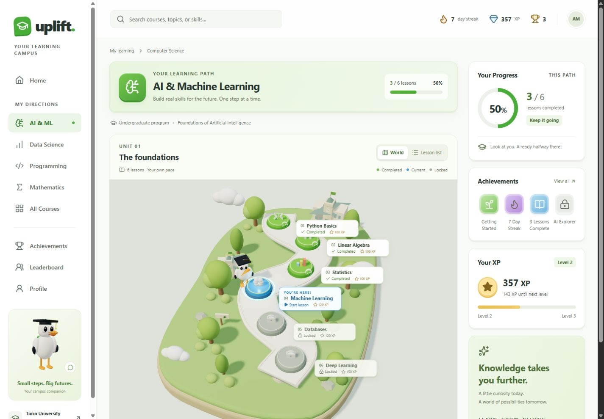
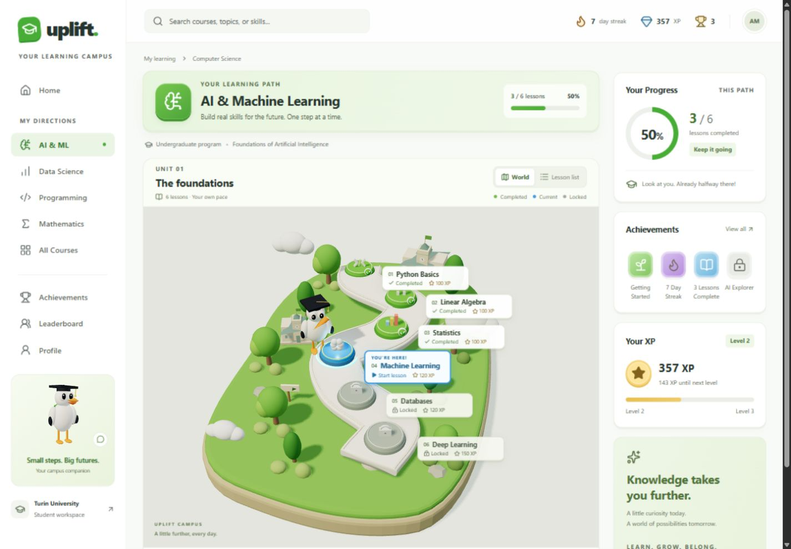
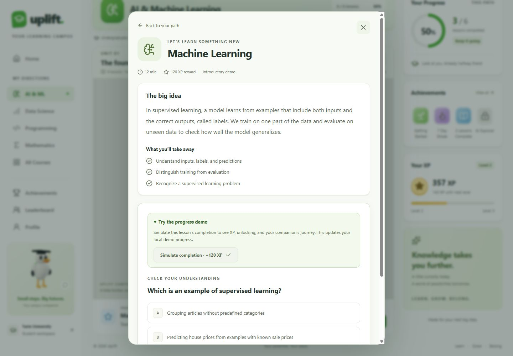
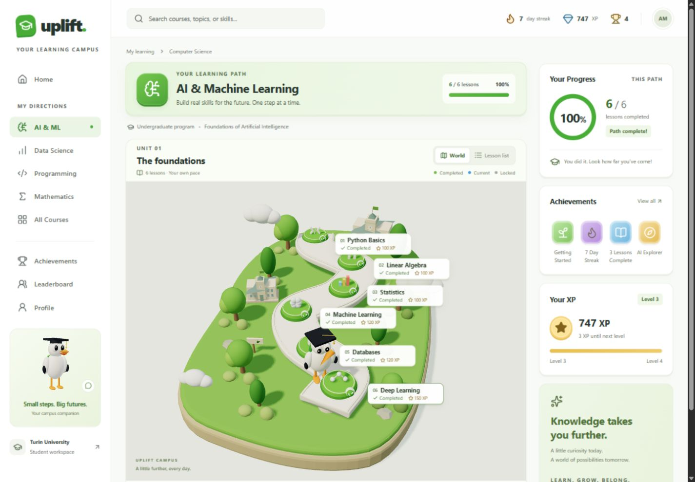
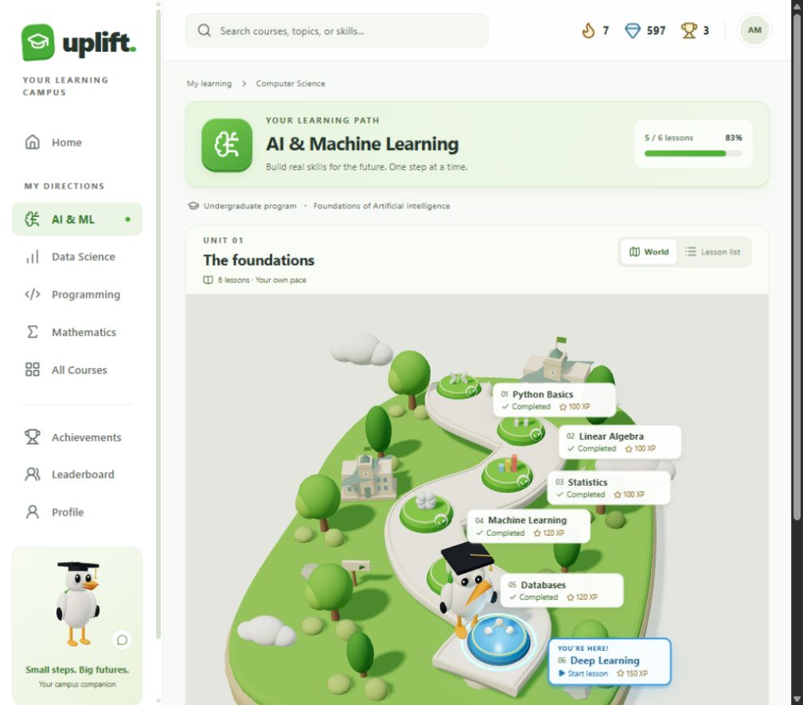
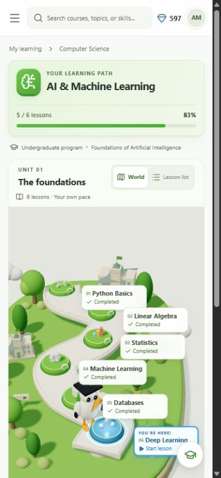
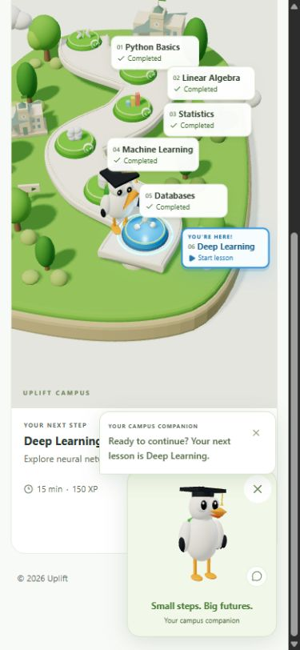

# Visual and interaction audit

Reference: `../design/reference.png`. Screenshots in this directory were captured from the running application during this phase.

## Baseline findings

1. **Desktop campus** (`01-before-desktop.png`): working three-column shell and real raised path. The mascot was too small, the green palette was muted, the active card was weak, and the header stack reduced the visible world. Updated the camera, road thickness, mascot scale, scenery placement, label contrast, active border, and header spacing.
2. **Tablet** (`02-before-tablet.png`): the right panel correctly collapses at 1024px while sidebar, stats, and world remain available. Preserved this behavior.
3. **Mobile** (`03-before-mobile.png`): the banner/header stack pushed the world too far down; small labels were difficult to read. Compressed the header, retained compact live XP, enlarged label targets, and reserved footer space for the assistant control.
4. **Lesson dialog** (`04-before-lesson.png`): the native dialog was pinned to the top-left by CSS reset defaults. Added explicit automatic margins. Kept the real lesson and knowledge check, with an expandable local completion demo.

## Updated flow

5. **Start and completion demo** (`05-demo-dialog.png`): centered modal with keyboard controls, normal quiz, and explicit local-state simulation.
6. **Completion and next lesson** (`06-after-completion.png`): Machine Learning becomes green, Databases becomes blue, XP advances from 357 to 477, and path progress updates to 4/6 (67%). WorldStork celebrates, follows the spline, then points at the new platform.
7. **Arrival** (`07-arrived-at-databases.png`): the mascot reaches the next platform and returns to idle with its feet on the road.
8. **Mobile assistant** (`08-mobile-assistant.png`): the compact control opens the companion, keyboard/click interaction displays the current lesson hint, and the close control restores the compact state.
9. **Mobile, 390 × 844** (`09-after-mobile.png`): compact header and XP, accessible lesson labels, and no horizontal overflow. Navigation opens, traps focus, and closes with Escape, returning focus to its trigger.
10. **Tablet, 1024 × 900** (`10-after-tablet.png`): navigation and assistant remain available, the right panel collapses, and the campus receives the remaining width. No horizontal overflow.
11. **Path complete** (`11-path-completed.png`): after the normal Databases knowledge check and the Deep Learning demo, progress reaches 6/6, XP reaches 747, and AI Explorer becomes earned.
12. **Production, 1440 × 1000** (`12-production-desktop.png`): final review after a successful production build. Initial 3/6 state, readable locked labels, physical road/platform edges, visible mascot, and three-column layout.
13. **Reduced motion** (`13-reduced-motion.png`): preference enabled on an already open page, then Machine Learning completed. XP reaches 477 and the mascot appears at Databases directly. DOM animations report zero. Disabling the preference restores animation without a reload.
14. **Pointer tracking** (`14-assistant-hover.png`, `15-assistant-tracking.png`): moving across the assistant changes head direction subtly. The second capture also catches the shared world mascot during a blink. Controller tests cover cooldowns, priority, and return to idle.

## Visual evidence

Before:

Production result:

## Final verification — 13 September 2026

- `npm run build`: passed, including TypeScript and route generation.
- `npm run lint`: passed.
- `npm test`: 15 passed, zero failures.
- `git diff --check`: no whitespace errors.
- Production server started with `npm run start -- -p 3001`; `/path/ai-ml` rendered and was inspected after the build.
- Fresh production navigation and assistant interaction produced no new console errors or warnings. Earlier development logs from replacing dependencies were excluded by timestamp.
- Both the normal knowledge-check flow and the local completion demo were exercised in the browser. Keyboard Enter opens lessons and the assistant; Escape closes the mobile navigation.

The result follows the reference's three-column composition, green campus, curved dimensional path, and blue active state. It remains a real-time procedural interpretation, not a pixel-identical recreation of the rendered reference character and scenery.

## Engineering review

- Frame callbacks modify scene objects; no React state is updated every frame.
- One visible assistant canvas, capped DPR (1.25 assistant / 1.5 world), one 1024² shadow map, no large textures or postprocessing.
- World rendering pauses behind the lesson modal; viewport/page visibility pause background canvases.
- Disabled assistant variants unsubscribe and clear queued reactions. Speech timers, media listeners, event subscriptions, and observers have cleanup.
- GLTF availability and the loaded asset are shared. Missing clips resolve to Idle or safe rest pose. Fallback lookup and controller reset have regression tests.
- Reduced-motion preference changes are reactive; walking and large procedural movement are disabled.
- Three.js 0.182 is pinned to match Fiber's Clock-based timing; warnings are not suppressed. PCF shadows are configured explicitly.

Screenshots do not establish full WCAG conformance or laptop-wide frame-rate guarantees. A commissioned GLB is not bundled; its final rig, head tracking, and animation quality will need visual verification when supplied.
